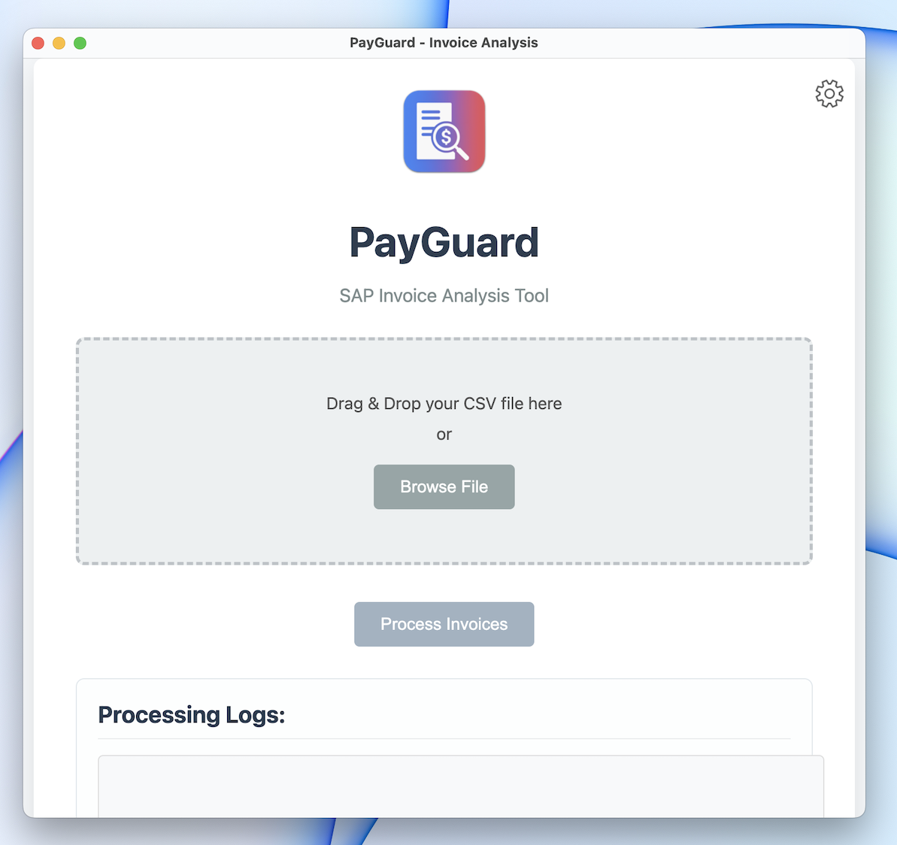

# PayGuard

PayGuard is an intelligent SAP invoice analysis tool that uses SBERT and LLM models to identify potential duplicate invoices.

**PayGuard Website:** you can manage your JSON SAP Prediction File at our website https://payguard-duplicate-detect.lovable.app/


<p align="center">
  
</p>


**Prerequisites:**

*   Access to a Gemini API key

**Clone the Repository (if you haven't already):**

```bash
git clone https://github.com/FelixSBuehrm/payguardml.git
cd payguardml
```

**1. Project Architecture**

PayGuard follows a modular architecture with clear separation between ML backend and Electron frontend:

```
├── app/                         # Electron frontend application
│   ├── main.js                  # Main Electron process
│   ├── renderer.js              # Renderer process for UI
│   ├── index.html               # Main UI layout
│   └── *.css                    # Styling files
├── assets/                      # Images and icons
├── backend/                     # Python backend for ML processing
│   ├── main.py                  # Main processing pipeline
│   ├── llm_classifier.py        # Gemini LLM integration
│   ├── pair_predictor.py        # Invoice pair prediction
│   ├── progress_monitor.py      # UI progress bar
│   └── utils.py                 # Utility functions
├── build/                       # Build assets for packaging
├── content/                     # Core ML models and data
│   ├── invoice_sbert/           # Pre-trained SBERT model
│   └── predict_pairs.py         # SBERT prediction functionality
├── output/                      # Generated analysis outputs
├── scripts/                     # Build and packaging scripts
├── SBERT_V3_GPU.ipynb           # SBERT Notebook Pipeline
├── val_pairs.csv                # Test data
├── training.csv                 # Training data
├── README.md
└── package.json                 # Project configuration
```

**2. Setup Backend:**

*   **Create `.env` file:**
    Navigate to the `backend/` directory and create a file named `.env`. Add your Gemini API key to it:
    ```
    # payguardml/backend/.env
    GEMINI_API_KEY="YOUR_GEMINI_API_KEY_HERE"
    ```
*   **Install Python Dependencies:**
    It's highly recommended to use a virtual environment.
    ```bash
    cd backend # if not already there
    python3 -m venv venv
    source venv/bin/activate  # On macOS/Linux
    # venv\Scripts\activate    # On Windows

    # Navigate to the content directory to install requirements
    cd ../content
    pip install -r requirements.txt
    cd ../backend # Go back to backend directory
    ```

**3. Setup Frontend (Electron App):**

*   **Install Node.js Dependencies:**
    Navigate to the project root directory (`payguardml/`) if you aren't already there.
    ```bash
    npm install
    ```

**4. Running the Application Locally:**

*   From the project root directory (`payguardml/`):
    ```bash
    npm start
    ```
    This will launch the PayGuard Electron application.

**5. Building the Application Locally:**

*   Ensure all dependencies are installed (`npm install`).
*   From the project root directory (`payguardml/`):

    *   **To build for your current platform (e.g., macOS):**
        ```bash
        npm run dist
        ```
        Alternatively, for specific platforms:
    *   **For macOS (creates .dmg and .zip):**
        ```bash
        npm run dist:mac-arm
        or 
        npm run dist:mac-intel
        ```
    *   **For Windows (creates NSIS installer and .zip):**
        (Requires a Windows environment or appropriate cross-compilation setup)
        ```bash
        npm run dist:win
        # or
        npm run dist:win-x64
        ```
    *   The distributable files will be located in the `dist/` directory.
